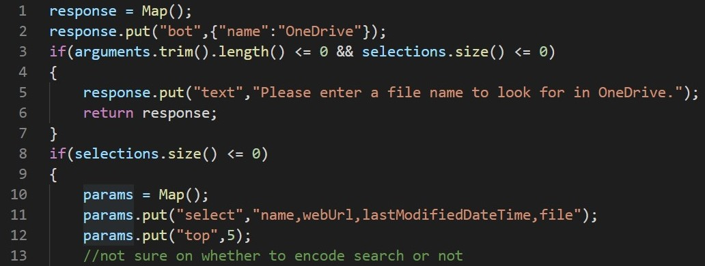
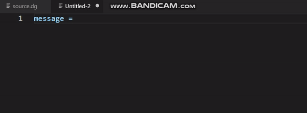
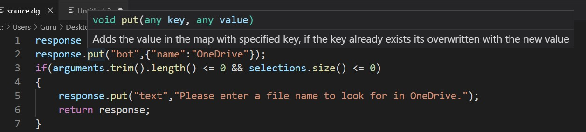
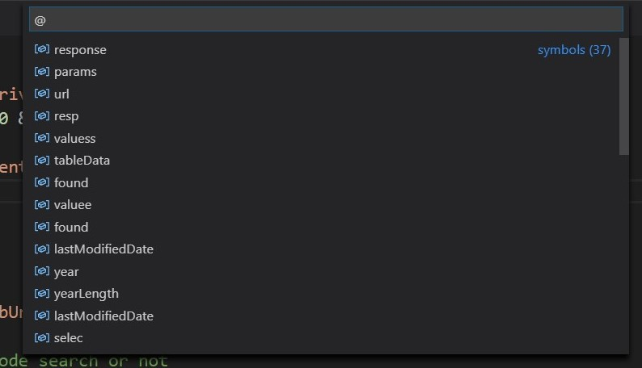
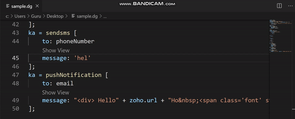
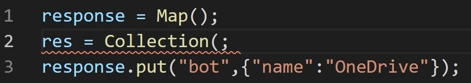

# Deluge-vscode

An vscode language client for the [deluge lang](https://www.zoho.com/creator/deluge.html). It interfaces with the [Deluge lang server](https://github.com/GuruDhanush/Deluge-Language-Parser). 

An Web editor is also available [here](https://gurudhanush.github.io/Deluge-Editor/).

> The extension currently takes deluge code with `dg` file extension. 

## Motivation

One of the problems that I found during my time as intern in Zoho Cliq was the lack of ability to write code locally from an editor. I set out to solve the problem as I was free for past few months and this might also help in my job search. The first step is to write a parser to validate code and then provide language smarts. The [Deluge lang server](https://github.com/GuruDhanush/Deluge-Language-Parser) provides most of the features.

> Tip: Install the extension, select the language as dg in the stauts-bar and you are good to go

## Features

### Syntax highlighting

### Snippets

### Hover docs

Docs for hover are stored in docs.yaml file. At the moment, hover only works for function calls.

### Symbols

Shows all the variables created in the document

### Codelens

The message property of some methods can hold html content. An rendered form of html after substituting varaibles as {Variables} is shown in web-view

### Diagnostics

Errors in the code will be shown with red swiggly's. At the moment, type of error is not specified. Once the lang server implements incremental compilation, this will be updated. 

Lang server doesnot detect errors in if\for statement test lines. 

> The state of the parser is shown in bottom left

## Extension Settings

* `deluge.homedir`: Homedir for parser and docs
* `deluge.trace.server`: set to `verbose` to see the messages between client and server

## Known Issues

* DateTime is implemented as due to inconsistency in the docs and implementation. i.e. whether to take `'sometext'` as string or validate as datetime.
* This strictly runs deluge compatible with cliq only

